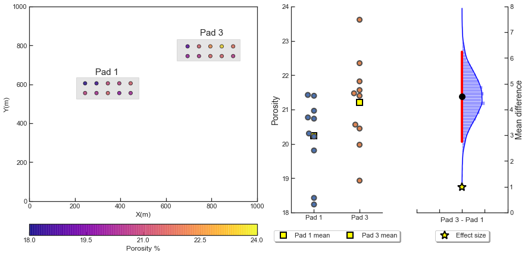
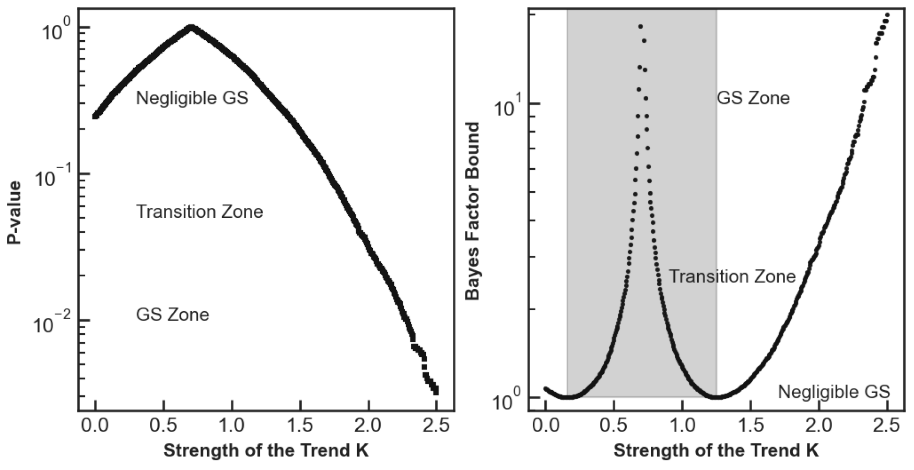

# Geostatistical Significance of Differences for Spatial Subsurface Phenomenon

Optimum subsurface development decision-making depends on uncertainty models integrating all information, data, and interpretations. Failure to account for the spatial context of subsurface data may lead to naïve and overconfident uncertainty estimations and, ultimately, negatively impact the economics of subsurface projects. Hence, I propose geostatistical significance, a workflow that helps determine whether an observed difference over spatial sample data is meaningful.

The proposed method empirically tests whether the difference in any metric observed over two spatial subsets is geostatistically significant. The workflow uses alternative metrics to p-values that provide limited information, prevent a dichotomous judgment, and display the accuracy of a confidence interval by representing its relative magnitude.




The method prevents false negatives. For example, the next image shows three zones: negligible geostatistical significance, transition zone, and geostatistical significance (GS) zone. Large p-values and small BFB characterize the negligible geostatistical significance zone. The zone indicates a range of trend models consistent with the available data based on the difference between well pads 2 and 1. On the other hand, the GS zone contains minute p-values and large BFB that largely favor the alternative hypothesis. The previous characteristics indicate that it is unlikely that the trend model would result in the observed difference between pads 2 and 1.



This is the code to replicate the results from the [scientific publication](https://doi.org/10.1016/j.petrol.2021.108694):

Salazar, J. J., Pyrcz, M. J. (2021). Geostatistical significance of differences for spatial subsurface phenomenon. Journal of Petroleum Science and Engineering, 203. doi:10.1016/j.petrol.2021.108694


## Installation

Use the available `requirements.txt` file.

```bash
pip install -r requirements.txt

```


## Contributing and collaborations

Pull requests are welcome. For major changes, please open an issue first
to discuss what you would like to change.

Please make sure to update tests as appropriate.

I'm happy to collaborate with other projects in data science, subsurface modeling, and machine learning for geosciences.

## License

[MIT](https://choosealicense.com/licenses/mit/)